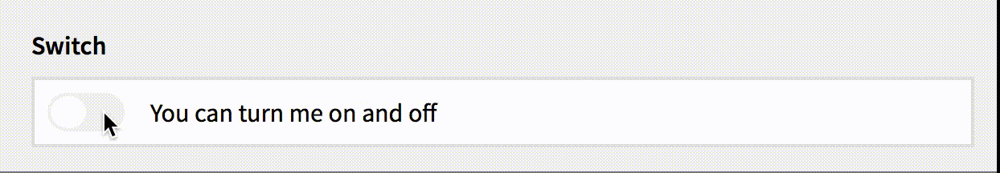

This plugin provides a switch toggle field for the Kirby 2 Panel:



## Requirements
Since version 1.0 the switch field requires Kirby CMS 2.3 or higher.  
If you are running an older version of Kirby, please use [version 0.5](https://github.com/distantnative/switch/releases/tag/v0.5) of the switch field.

## Installation & Update
Copy the files to `site/plugins/field-switch/`.

## Usage
In your blueprint:

```
switch:
  label: Switch
  type:  switch
  text:  You can turn me on and off
```

If you want different texts for on and off state:

```
switch:
  label:    Switch
  type:     switch
  texts: 
    - I am on, you can turn me off
    - I am off, you can turn me on
```

As the switch field is basically just a restyled single checkbox, [this documentation](http://getkirby.com/docs/cheatsheet/panel-fields/checkbox) applies.
